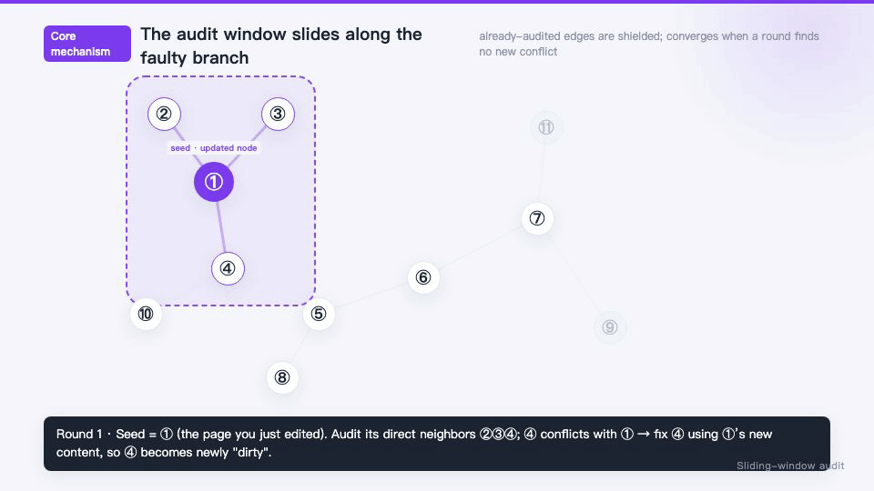

# better-llm-wiki

A self-compiling markdown knowledge base for LLM agents. Instead of RAG
(re-retrieving raw documents on every query), an agent **compiles** raw sources
into a persistent, cross-linked wiki. Every ingest, query, discussion, lint, and
audit pass makes the wiki richer — knowledge compounds, and a human stays in the
loop through a structured feedback channel.

Inspired by [Andrej Karpathy's llm-wiki Gist](https://gist.github.com/karpathy/442a6bf555914893e9891c11519de94f)
and aligned with the [Open Knowledge Format (OKF)](https://cloud.google.com/blog/products/data-analytics/how-the-open-knowledge-format-can-improve-data-sharing):
plain markdown is the source of truth, a file's path is its identity, and links
between pages are ordinary root-anchored markdown links.

## Why this shape

- **Markdown is the truth.** Human-readable, git-friendly, portable. No database
  to migrate, no vendor format to escape.
- **The path is the identity; the links are the graph.** Pages link each other
  with a content-root anchor — `[Attention](/concepts/Attention.md)` — a leading
  `/` that resolves at the wiki content root. One rule everywhere; no `../` to
  compute, no prefix to remember.
- **`type` classifies, not the folder.** Each page declares a `type` in its
  frontmatter (`concept` / `entity` / `summary` / `paper` / …). Directories are
  domain-driven, so the structure follows the subject, not a fixed taxonomy.
- **The human stays in the loop.** An `audit/` inbox captures corrections as
  durable files instead of losing them in chat history; the agent must process
  them before the wiki is considered healthy.

## How it works

**Compile, don't retrieve.** RAG chops sources into chunks and re-retrieves them
by similarity on every question — the model never builds a lasting understanding.
Here the agent instead acts like a meticulous editor: it reads a source once,
writes it into short cross-linked pages, and from then on *reasons over the wiki*.
Each source typically touches 5–15 pages (a summary, some concept pages, a few
entity pages) and every reference becomes a real markdown link, so the corpus
grows into a navigable graph rather than a pile of fragments.

**The representation is just files (OKF).** Three moving parts, nothing else:

- `raw/` — immutable source text (the agent reads it, never rewrites it; not
  counted toward size budgets).
- `wiki/` — the generated knowledge: short pages (~400–1200 words) classified by
  a frontmatter `type`, linked with content-root anchors `[…](/concepts/Foo.md)`.
- `SCHEMA.md` + `INTEREST.md` — the wiki's scope/conventions, and a soft
  steering profile that nudges query ranking toward what you care about.

Derived layers (`.query-index/` SQLite, `graph/` graph files) are rebuilt on
demand and can be deleted at any time. Markdown is the only source of truth.

**The anti-hallucination loop.** The most common failure of an AI writing a wiki
is inventing facts or link targets. Two hard rules prevent it: *read before you
write* (`query` the wiki + open the `raw/` source you're grounding in), and *lint
after you write* (a script checks dead links, orphans, missing index entries,
banned `../`, frontmatter, and cross-page numeric conflicts). The agent fixes
everything lint reports before the edit is considered done. (Self-auditing goes
further — see below.)

## The five operations

Everything the agent does is one of five verbs — think of them as **feed, ask,
correct, keep** in daily use. Each one appends a line to the day's log so the
wiki's history is auditable.

- **`ingest` (feed)** — add a source. It lands twice: the original into `raw/`,
  and the *understanding* into `wiki/` as 5–15 short cross-linked pages (a
  summary, some concept pages, a few entity pages), each with a frontmatter
  `type` and content-root links. This is the compile step that turns a document
  into graph nodes.
- **`query` (ask)** — answer a question **grounded only in the wiki**, never from
  the model's general knowledge. It ranks candidate pages (keyword + graph
  proximity + recency + centrality + your `INTEREST.md`), reads them, and
  synthesizes. Miss in the index? It re-checks `index.md` before concluding
  "not in the wiki" — and then says so instead of fabricating.
- **`compile` (restructure)** — keep pages small: split anything past ~1200 words
  into a folder, merge near-duplicates, rebuild `index.md`. Structure is
  maintained, not left to rot.
- **`lint` (keep / checkup)** — the health check, run after every write and
  incremental by default. Priority order: (1) block if `audit/` has unprocessed
  feedback; (2) error on oversized pages / page-count guard; (3) hard errors on
  dead links, `../`, missing `/`, missing frontmatter; (4) soft signals for
  possible contradictions and cross-page numeric conflicts; (5) refresh page
  sidecars and `recent.graph` incrementally, reserving the remaining global
  graph artifacts for `--full`. **The dividing line: what a machine can be 100 % sure of is
  a hard error; what needs judgment is a soft signal handed to the agent.**
- **`audit` (correct)** — the quality net (below). Machine-run day to day; humans
  step in only to file a correction.

Binding them is one discipline — **read before you write, lint after you write** —
plus a light **self-evolution** pass that files durable discussion takeaways into
`outputs/` and interest signals into `INTEREST.md`. Full protocol in
`better-llm-wiki/SKILL.md`; copy-paste commands in
`better-llm-wiki/references/commands.md`.

### Self-auditing, as a fixpoint

The wiki is AI-written, so it will be wrong sometimes, and human sources
contradict each other. After an ingest, `ingest_scan.py` takes the pages you
just touched and expands **one hop** along the link graph, handing back that
neighborhood as a reading list. The agent reads it and reconciles any conflict
(stale numbers, clashing definitions). Here's the flywheel: **fixing a page edits
it, which makes it the seed of the next round's one-hop scan** — the window
slides outward, round after round, until a scan surfaces nothing new. That
fixpoint *is* "the wiki is internally consistent." A bounded queue (already-seen
nodes are shielded) guarantees it terminates. Corrections that need a human land
in the `audit/` inbox as durable files — `lint` refuses to pass while any are
unprocessed, so feedback never gets lost in chat history.



## When it fits (and when it doesn't)

The whole point is **deep integration and knowledge that evolves** — that draws
the boundary sharply.

**Good fit** — networks worth curating and iterating over time:

- Concept/architecture encyclopedias for a complex system, or the lore of a
  sprawling novel/game — heavy cross-referencing where adding a module or
  character should auto-update related pages and pull new links. RAG's fragment
  retrieval can't give you that.
- High-value vertical knowledge bases (clinical guidelines, compliance manuals)
  where the enemy is contradiction, not volume — ingesting a new rule surfaces
  "this conflicts with the 2024 §3, revise or mark deprecated?".
- A team's living handbook (onboarding, best practices) fused from scattered
  chat and weekly notes into an always-current SOP.

**Bad fit** — reach for RAG / a database / full-text search instead:

- High-volume, low-density logs (support tickets, error logs, transactions). The
  data is "dead" — it needs neither interlinking nor rewriting; weaving a graph
  just burns tokens.
- A chaotic dump of unvetted early material. Garbage woven deep into the graph
  produces a well-edited tower of rumors — worse than no structure.

## Layout

```
better-llm-wiki/     ← the skill: SKILL.md + scripts/ + references/
demo-wiki/           ← a sample knowledge base (LLM-research topic) with graph output
web/                 ← local Node preview server (renders mermaid/KaTeX, files audits)
audit-shared/        ← TypeScript library for the audit file schema
demo-graph-viewer.html ← zero-dependency local .graph viewer
```

## Scripts

- **`wiki.py`** — one entrypoint for everything: `python3 wiki.py <command> <root> [opts]` forwards to the scripts below. `python3 wiki.py help` prints the command list and the write loop. You never need to remember the individual filenames.
- **`scaffold.py`** — bootstrap a new wiki (`SCHEMA.md`, `INTEREST.md`, `wiki/`, `log/`, `audit/`, …).
- **`index_wiki.py`** — compile markdown into a local SQLite query index for long-running wikis.
- **`query_wiki.py`** — rank candidate pages for agent answers by keyword match, graph relevance, recency, centrality, and `INTEREST.md` soft preferences.
- **`evolve_wiki.py`** — capture discussion-derived increments and update `INTEREST.md`.
- **`lint_wiki.py`** — validate the wiki (dead links, orphans, index coverage, audit shape) and compile the `.graph` artifacts. Incremental by default.
- **`ingest_scan.py`** — scope a fresh ingest's 1-hop neighborhood as a sliding-window audit reading list.
- **`audit_cr.py`** — build a correction/contradiction register from open and resolved audits.
- **`commit_wiki.py`** / **`rollback_wiki.py`** — checkpoint the truth-source state into git, backfill a missing activity-log entry with explicit touched-page links, refresh `recent.graph`, and roll a checkpoint back.
- **`migrate_okf.py`** — canonicalize an existing wiki to the OKF-style representation (rewrite `wiki/…` links to `/…`, backfill `type`). Optional and idempotent — the scripts recognize both forms.

## Scaling — from tens of MB to tens of GB without crashing

The size budget counts only `wiki/` markdown (bulk sources live in `raw/`, which
is not counted). The design keeps the *daily* operations cheap no matter how big
the corpus gets, and refuses the *expensive* one before it can OOM:

- **Change-detection is O(changes), not O(corpus).** When a wiki is its own git
  repo, incremental `lint` and `query` find what changed via `git status` +
  `git diff <last-linted-commit> HEAD` — no whole-corpus scan. Measured: cold
  incremental lint holds flat at **28 MB whether the wiki has 20k or 50k pages**;
  a repeat query on an unchanged 50k-page wiki dropped from 147 MB to **30 MB**.
  Because memory is decoupled from corpus size, tens of GB is a disk question,
  not a RAM one.
- **The query index carries lookups at scale.** `index_wiki.py` builds a SQLite
  + FTS5 index by streaming (bounded memory), reindexing only changed pages;
  `query_wiki.py` searches it with `LIMIT`, so it never loads the whole corpus.
- **Whole-graph `lint --full` is intentionally bounded.** Its peak memory scales
  with pages loaded (~30 KB/page), so it warns at 25k pages and refuses above
  80k (env-overridable) with guidance to use incremental lint + query instead —
  it degrades gracefully rather than crashing.
- **Self-pruning.** Oversized pages split into folders, near-duplicates merge,
  cold material moves to `raw/`, and `INTEREST.md` keeps the active surface small.

Keep each wiki as its own git repo (run `wiki.py commit` after each change) so
the O(changes) fast paths engage.

## Quick start

```bash
SKILL=better-llm-wiki/scripts          # the skill's scripts dir
WIKI=<your knowledge path>/my-wiki      # your wiki root

# 1. Scaffold a wiki (once)
python3 $SKILL/wiki.py scaffold $WIKI "My Research Topic" --lang en
git -C $WIKI init && python3 $SKILL/wiki.py commit $WIKI   # make it its own git repo

# 2. Add a source, then tell your agent: "ingest raw/articles/my-article.md"
cp my-article.md $WIKI/raw/articles/

# 3. Ask questions (auto-builds/refreshes the query index)
python3 $SKILL/wiki.py query $WIKI "what does the wiki say about X?"

# 4. Lint after every write (incremental by default; --full for a periodic deep check)
python3 $SKILL/wiki.py lint $WIKI

# 5. Checkpoint into git (final step of any write op)
python3 $SKILL/wiki.py commit $WIKI
```

`python3 $SKILL/wiki.py help` lists every command and the canonical write loop.

To use it as an agent skill, copy `better-llm-wiki/` into your skill directory,
or paste `better-llm-wiki/SKILL.md` into your agent's context.

## License

[**PolyForm Noncommercial License 1.0.0**](LICENSE.md) — free for **any
noncommercial purpose**: personal study, hobby and amateur projects, private
entertainment, research, education, and nonprofit/government use. **Commercial
use is not permitted.** For a commercial license, contact the author.
