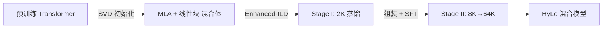

# HyLo

HyLo（Long-Context Aware Upcycling）是 AMD 提出的一种混合架构升级方法，将预训练的 Transformer 模型转换为高效的混合模型，同时保持短上下文质量并大幅提升长上下文能力。

## 核心思想

传统混合架构（如 Jamba、Samba）需要从零训练，成本高昂。HyLo 通过 [模型升级改造](</concepts/Model Upcycling.md>) 范式复用已有 Transformer 的知识，用远少于预训练的计算量获得混合架构的效率优势。

区别于之前的升级方法，HyLo 将**长上下文保持**作为一等目标，而非仅关注短上下文性能。

## 架构组成

混合模型由两类层交替组成：

- **[Multi-Head Latent Attention](</concepts/Multi-Head Latent Attention.md>)（MLA）层**：压缩 KV 缓存，保持注意力机制的长距离依赖建模
- **线性块**：[Mamba2](/entities/Mamba.md) 或 [Gated DeltaNet](</concepts/Gated DeltaNet.md>)，提供 O(n) 复杂度的序列建模

## 训练流程

1. **SVD 初始化**：从教师模型权重分解迁移到 MLA/线性块
2. **Stage I — Enhanced-ILD**：在 2K 上下文上，用 20% 数据对齐隐状态和 token-mixer 输出
3. **Stage II — 长上下文 SFT**：组装混合模型，从 8K 渐进扩展到 64K，使用 [知识蒸馏](</concepts/Knowledge Distillation.md>) 稳定训练

## 性能表现

| 指标 | HyLo | 对比基线 |
|------|------|---------|
| KV 缓存压缩 | >90% | Transformer 100% |
| 最大推理上下文 | 200 万 token | Llama 3B 在 128K OOM |
| RULER-64K | 41.6（8MLA8GDN） | MambaInLlama: 0.0 |
| GSM8K | 73.8（Qwen 变体） | JetNemotron: 更低，但用了 40× 数据 |

## 相关页面

- [长上下文训练](</concepts/Long-Context Training.md>) — HyLo 的分阶段上下文扩展策略
- [vLLM](/entities/vLLM.md) — HyLo 的推理框架集成
- [摘要](/summaries/hylo-long-context-aware-upcycling.md) — 论文完整摘要

