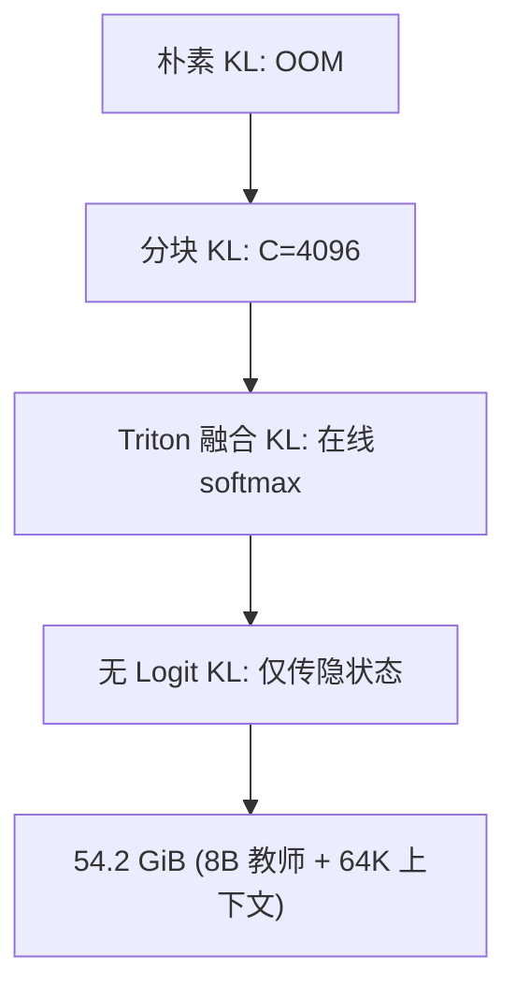

# 知识蒸馏（Knowledge Distillation）

在 LLM 语境中，知识蒸馏是用一个大型教师模型指导小型学生模型训练的技术。[HyLo](/concepts/HyLo.md) 在 [模型升级改造](</concepts/Model Upcycling.md>) 的两个阶段都使用了不同形式的蒸馏。

## HyLo 中的两阶段蒸馏

### Stage I: Enhanced-ILD（增强型中间层蒸馏）

在每一层同时对齐隐状态和 token-mixer 输出：

$$\mathcal{L}_{ILD} = \sum_{\ell=1}^{L} \left[ \|h^{(s)}_\ell - h^{(t)}_\ell\|_2 + \|a^{(s)}_\ell - a^{(t)}_\ell\|_2 \right]$$

其中 $h$ 是隐状态，$a$ 是注意力/token-mixer 输出。标准 ILD 只对齐隐状态；Enhanced-ILD 增加 token-mixer 项后，GSM8K 提升 5–6 分。

### Stage II: 输出级 KL 蒸馏

在长上下文 SFT 阶段使用 KL 散度对齐 softmax 输出：

$$\mathcal{L}_{SFT} = D_{KL}(\text{softmax}(z^{(s)}) \| \text{softmax}(z^{(t)}))$$

## 内存高效蒸馏技术

64K 上下文下 KL 蒸馏面临严重显存瓶颈。HyLo 提出四级优化：

1. **Fused Linear CE**：合并 LM head 投影与损失计算，避免全量 logit 物化
2. **分块 KL**：将序列分为 $C=4096$ 的块，峰值显存从 $2TV$ 降到 $2CV$
3. **Triton 融合 KL**：自定义 kernel 使用在线 softmax，块内沿词表维度分片计算
4. **无 Logit 蒸馏**：教师仅返回最终隐状态，在融合 kernel 内直接计算 KL，省去约 32 GB logit 存储

## 教师规模的影响

| 教师规模 | 短上下文提升 | 长上下文提升（RULER-64K） |
|---------|------------|----------------------|
| 无教师 | 基线 | 基线 |
| 1B 教师 | +2% | +8% |
| 8B 教师 | +6% | +22% |

关键发现：**蒸馏对长上下文的提升远大于短上下文**。这可能是因为长上下文推理需要更精确的注意力模式，而教师模型可以提供更好的监督信号。

## 相关页面

- [HyLo](/concepts/HyLo.md) — 使用蒸馏的混合架构方法
- [长上下文训练](</concepts/Long-Context Training.md>) — 蒸馏在上下文扩展中的作用
- [Multi-Head Latent Attention](</concepts/Multi-Head Latent Attention.md>) — Stage I 蒸馏的目标层
