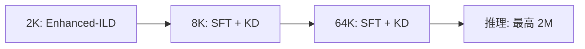

# 长上下文训练

长上下文训练指通过后训练手段将模型的有效上下文窗口从原始长度（如 2K–8K）扩展到更长范围（如 64K–2M）的技术。[HyLo](/concepts/HyLo.md) 将其作为 [模型升级改造](</concepts/Model Upcycling.md>) 的核心目标。

## 两种路径

### 位置插值（YaRN 等）

通过修改位置编码的频率因子，将短上下文模型"拉伸"到更长范围：

- RoPE 缩放因子从原始 $\theta$ 调整为 $\theta / s$
- YaRN 对不同频率分量使用不同缩放策略
- 优点：无需长序列训练数据
- 缺点：短上下文质量略有下降，长上下文效果不如直接训练

### 直接长上下文训练

在目标长度上直接微调模型。HyLo 的实验表明：

> 直接 64K 训练在长上下文性能上优于 8K + YaRN 扩展，同时保持相当的短上下文准确度。

### 轨迹编译训练

[Agent Context Compilation](</concepts/Agent Context Compilation.md>) 提供另一条路径：不先构造自然长文档，而是复用 Search、SWE、SQL agent 的多轮轨迹，把工具响应和环境观察编译成长上下文 QA 对。它把分散证据直接暴露给最终答案监督，用于训练模型跨远距离片段整合信息。

## HyLo 的分阶段策略

1. **2K 阶段**：用 Enhanced-ILD 对齐各层（20% 数据）
2. **8K 阶段**：组装混合模型，初步长上下文适配
3. **64K 阶段**：最终长上下文扩展，使用内存高效 [知识蒸馏](</concepts/Knowledge Distillation.md>)

每个阶段的 YaRN 缩放因子相应调整（4.0 到 32.0）。

## 内存瓶颈与解决方案

64K 上下文训练的核心挑战是显存：在 $T=65536$, $V=128256$ 时，单个 logit 矩阵约 16 GB。HyLo 的解决路径：

| 技术 | 显存（GiB） |
|------|-----------|
| 朴素 CE + 激活检查点 | 131 |
| Fused Linear CE + 激活检查点 | 29.6 |
| 8B 教师 + Fused KL Hidden + 激活检查点 | 54.2 |

关键优化：分块 KL 散度（$C=4096$）将峰值显存从 $2TV$ 降到 $2CV$。

## 消融结果

- 直接 64K 训练：RULER-64K = 37.9%
- 8K + YaRN：RULER-64K = 31.3%
- 教师蒸馏对长上下文提升远大于短上下文（+22% vs +6%）
- ACC 轨迹编译：MRCR +18.09，GraphWalks +7.59

## 相关页面

- [HyLo](/concepts/HyLo.md) — 长上下文感知的混合架构方法
- [Agent Context Compilation](</concepts/Agent Context Compilation.md>) — 从 agent 轨迹构造长上下文监督
- [知识蒸馏](</concepts/Knowledge Distillation.md>) — 长上下文训练中的核心技术
- [vLLM](/entities/vLLM.md) — 支撑 200 万 token 推理的框架
