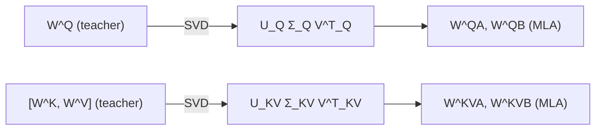

# 模型升级改造（Model Upcycling）

模型升级改造是指将已预训练的 Transformer 模型转换为不同架构（通常是更高效的混合架构），同时保留原模型学到的知识。相比从零训练混合模型，这种方法可以节省数量级的计算成本。

## 动机

训练一个大型混合 LLM（如 Jamba、Samba）需要数万亿 token 的预训练数据和数千 GPU 小时。升级改造通过复用已有模型的权重和知识，以远低于全量预训练的成本获得新架构的效率优势。

## 既有方法

| 方法 | 核心思路 | 局限 |
|------|---------|------|
| MambaInLlama | 用预训练注意力层初始化 SSM 块 | 仅关注短上下文 |
| Llamba | 蒸馏式递推模型 | 长上下文能力有限 |
| X-EcoMLA | Transformer → MLA 转换，压缩 KV | 未处理线性块 |
| Zebra-Llama | Mamba2 + MLA，改进初始化和蒸馏 | 长上下文非核心目标 |
| [HyLo](/concepts/HyLo.md) | MLA + 线性块，**长上下文作为一等目标** | — |

## 关键技术

### SVD 权重迁移

从教师模型的注意力权重通过奇异值分解迁移到目标架构：

### 分阶段训练

升级改造通常包含两个阶段：
1. **局部蒸馏**：在短上下文上对齐各层输出
2. **全局微调**：在目标上下文长度上用 [知识蒸馏](</concepts/Knowledge Distillation.md>) 微调整体模型

## HyLo 的贡献

HyLo 的核心区别在于：既有升级方法**几乎完全忽略长上下文能力**，仅验证短上下文指标。HyLo 将 [长上下文训练](</concepts/Long-Context Training.md>) 作为一等目标，通过分阶段上下文扩展和内存高效蒸馏实现 32 倍上下文窗口延伸。

## 相关页面

- [HyLo](/concepts/HyLo.md) — 长上下文感知的升级改造方法
- [Multi-Head Latent Attention](</concepts/Multi-Head Latent Attention.md>) — 升级后的注意力机制
- [知识蒸馏](</concepts/Knowledge Distillation.md>) — 升级改造中的核心训练手段
